# Automated Website Deployment using Jenkins, Docker & Git

This project demonstrates how a CI/CD pipeline is implemented to automate website deployment using Jenkins, Docker, and Git (GitHub for version control) on Ubuntu servers. Whenever new code is pushed to GitHub, Jenkins automatically retrieves the changes, builds a Docker image, and redeploys the website. This process ensures continuous integration and continuous delivery, keeping the website consistently updated and reducing manual effort.

---

##  Table of Contents

- [Project Overview](#project-overview)
- [Technologies Used](#technologies-used)
- [Setup & Implementation](#setup--implementation)
- [Outputs](#outputs)
- [Conclusion](#conclusion)

---

##  Project Overview

This project automates the deployment of a static website using Jenkins, Docker, and GitHub. It showcases a simple CI/CD pipeline where any code change pushed to GitHub is built into a Docker image and deployed automatically using Jenkins.

---

##  Technologies Used

- Ubuntu Server 24.04 LTS
- Git & GitHub
- Jenkins
- Docker
- Apache Web Server

---

##  Setup & Implementation

###  Step 1: Developer Setup (Dev Instance)

Launch an Ubuntu instance and download the website.

<div align="center">
  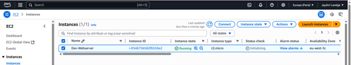
  <p><strong>Dev Server Instance</strong></p>
</div>

---

###  Step 2: Creating the Dockerfile

Create a Dockerfile to package the website with Apache web server.

<div align="center">
  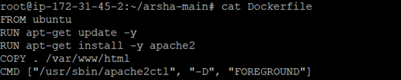
  <p><strong>Dockerfile Setup for Website Deployment</strong></p>
</div>

---

###  Step 3: Git Initialization and Push

```bash
git init
git add *
git commit -m "Initial commit - Devops Website"
git remote add origin https://github.com/jayshrilandge30/Devops_auto_deploy_website.git
git push -u origin master
```

<div align="center">
  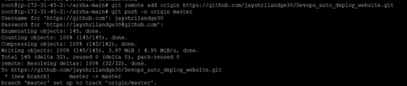
  <p><strong>Terminal Output of Git Push Command</strong></p>
</div>

<div align="center">
  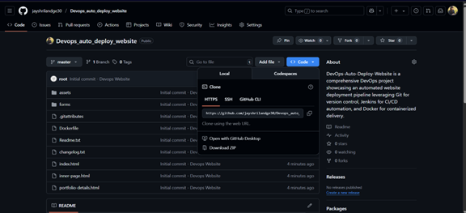
  <p><strong>Remote Repository – Data Pushed Successfully</strong></p>
</div>

---

###  Step 4: Jenkins Master Setup

Set up Jenkins on another Ubuntu instance.

<div align="center">
  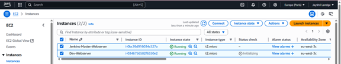
  <p><strong>Add Jenkins-Master Instance</strong></p>
</div>

<div align="center">
  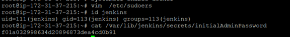
  <p><strong>Configure Jenkins Sudo Access & Retrieve Admin Password</strong></p>
</div>

<div align="center">
  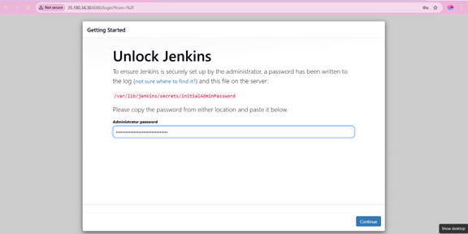
  <p><strong>Unlocking Jenkins with Initial Admin Password</strong></p>
</div>

<div align="center">
  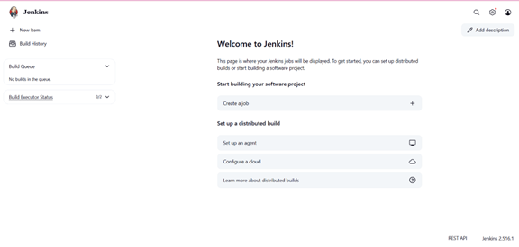
  <p><strong>Jenkins Dashboard Access</strong></p>
</div>

---

###  Step 5: Webhook Setup

Add webhook in GitHub repository pointing to Jenkins:

```
http://<Jenkins-Master-IP>:8080/github-webhook/
```

<div align="center">
  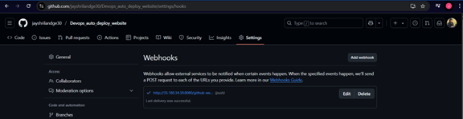
  <p><strong>GitHub Webhook Configuration</strong></p>
</div>

---

###  Step 6: Jenkins Job Configuration

```bash
sudo docker rm -f container1 || true
sudo docker build -t webserver-image .
sudo docker run -itd --name container1 -p 5000:80 webserver-image
```

<div align="center">
  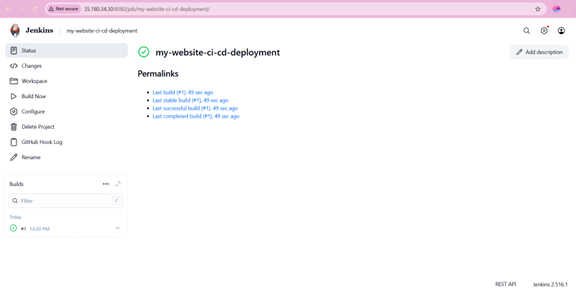
  <p><strong>Jenkins Job Configuration & Console Output</strong></p>
</div>

---

###  Step 7: Access Deployed Website

<div align="center">
  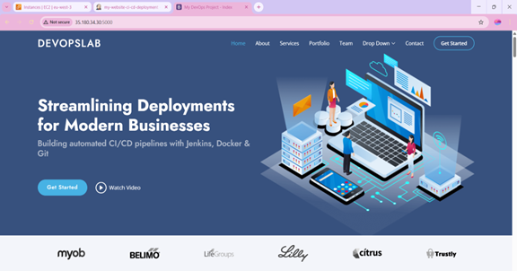
  <p><strong>Website Deployed on Port 5000</strong></p>
</div>

---

###  Step 8: Making Future Updates

Edit the `index.html` file and push changes to trigger an automated rebuild and redeployment.

<div align="center">
  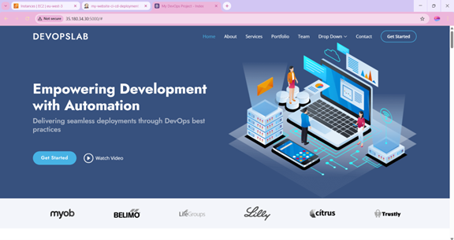
  <p><strong>Post-Build Website Output After Update</strong></p>
</div>

---

###  Step 9: Jenkins Agent Node (Optional)

Set up a second Ubuntu instance as a Jenkins agent node (Node1).

<div align="center">
  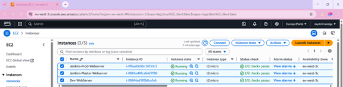
  <p><strong>Jenkins-Prod Node Setup</strong></p>
</div>

<div align="center">
  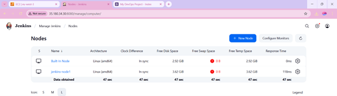
  <p><strong>Jenkins Agent Node1 Connected</strong></p>
</div>

<div align="center">
  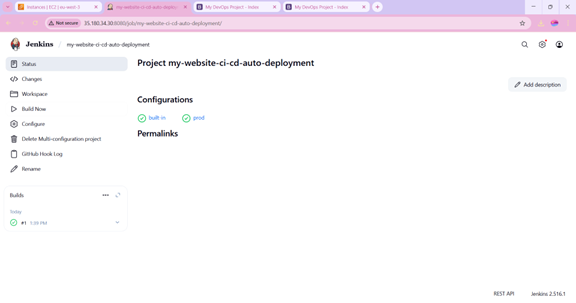
  <p><strong>Multiconfiguration Job on Master & Node1</strong></p>
</div>

<div align="center">
  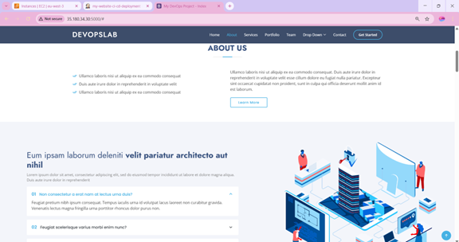
  <p><strong>Website Output – Before Jenkins Agent Setup</strong></p>
</div>

<div align="center">
  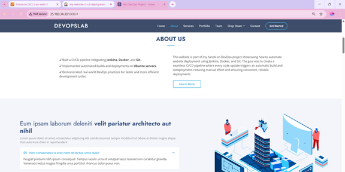
  <p><strong>Website Output – After Changes Deployed via Node1</strong></p>
</div>

---

##  Outputs

<div align="center">
  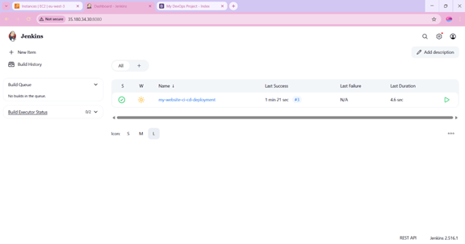
  <p><strong>Jenkins Dashboard Showing Job Status</strong></p>

  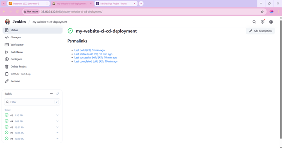
  <p><strong>Jenkins Build Console Output – Status Log</strong></p>

  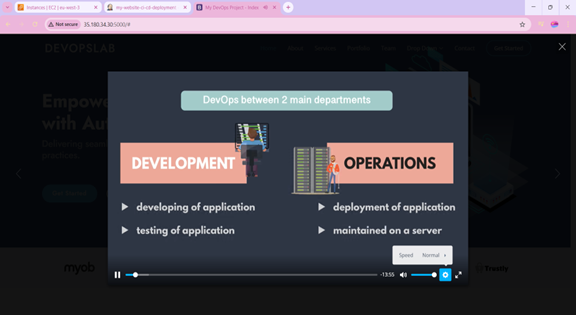
  <p><strong>Website “Watch Video” Button Output</strong></p>

  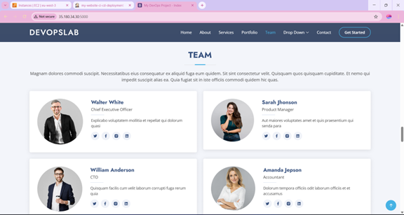
  <p><strong>Team Page Output</strong></p>

  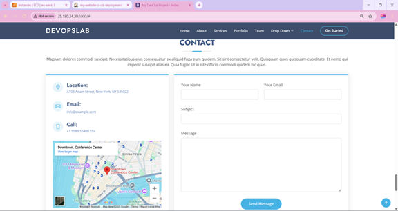
  <p><strong>Contact Form View</strong></p>

  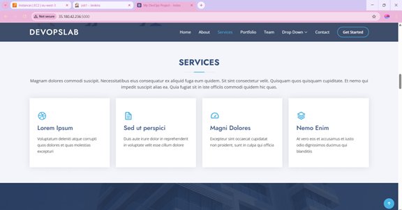
  <p><strong>Services Section</strong></p>

  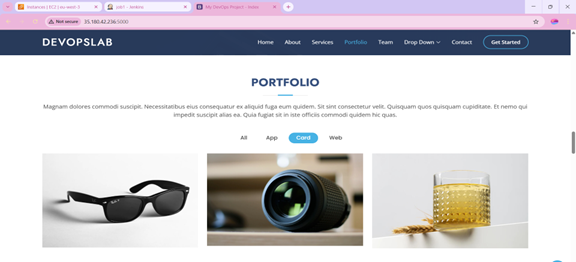
  <p><strong>Portfolio Section Output</strong></p>

  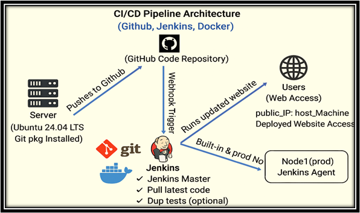
  <p><strong>Automated Web Deployment Architecture Diagram</strong></p>
</div>

---

##  Conclusion

- ✅ Used Git to manage and version website source code.
- ✅ Dockerized the application and used Apache server.
- ✅ Jenkins enabled full CI/CD automation.
- ✅ GitHub webhook ensured continuous integration.
- ✅ Optional Jenkins agent allowed scalable deployment.


